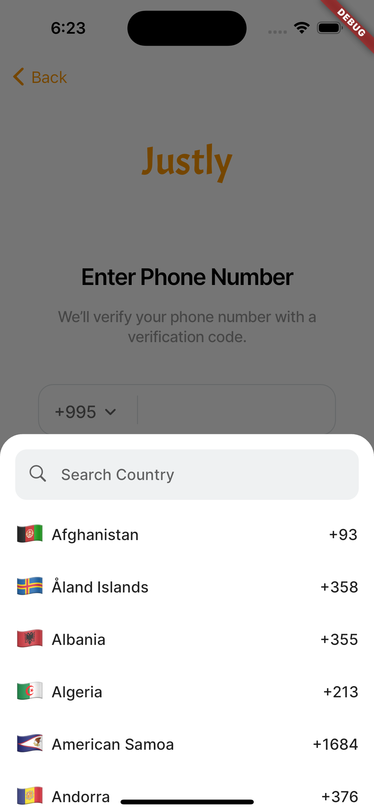
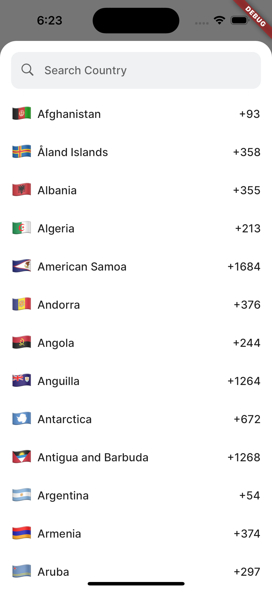
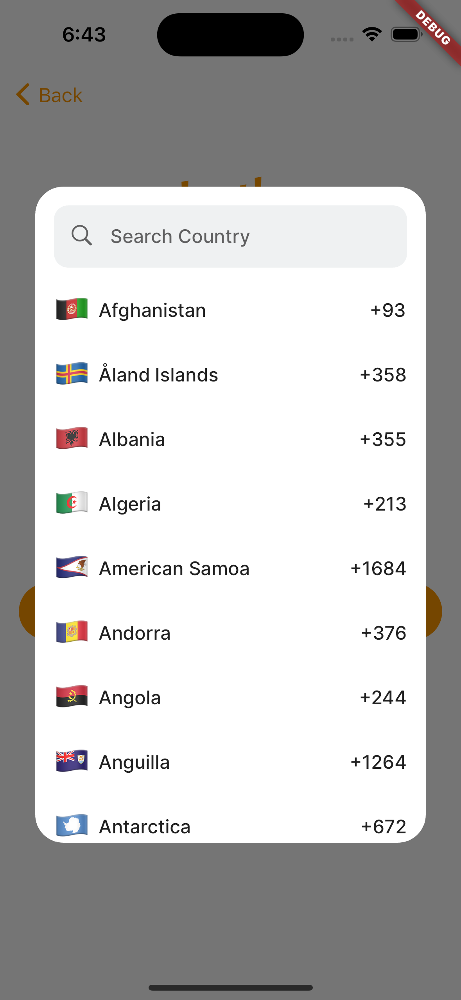
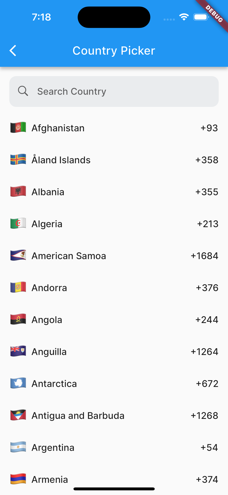

Fully customizable Flutter library that allows developers to integrate a feature-rich country code picker 
into their applications. It includes built-in filtering options for easily selecting and displaying country 
codes based on search.

## Preview

### Bottom sheet picker



### Dialog


### UI Component



## How To Use
```dart
const like = 'sample';
```

## Bugs and Feedback
For bugs, questions and discussions please use the [Github Issues](#bugs-and-feedback).

## Credits
Canopas Country Picker is owned and maintained by the [Canopas team](https://canopas.com/).
You can follow us on Twitter at [@canopassoftware](https://twitter.com/canopassoftware) for project updates and releases.

We regularly upload blogs on new topics, which you can read [here](https://blog.canopas.com/).

## Licence
```
Copyright 2023 Canopas Software LLP

Licensed under the Apache License, Version 2.0 (the "License");
you may not use this file except in compliance with the License.
You may obtain a copy of the License at

   http://www.apache.org/licenses/LICENSE-2.0

Unless required by applicable law or agreed to in writing, software
distributed under the License is distributed on an "AS IS" BASIS,
WITHOUT WARRANTIES OR CONDITIONS OF ANY KIND, either express or implied.
See the License for the specific language governing permissions and
limitations under the License.
```